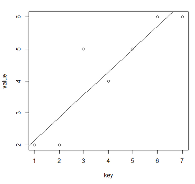
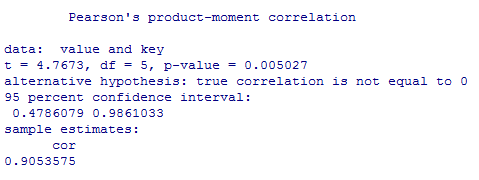
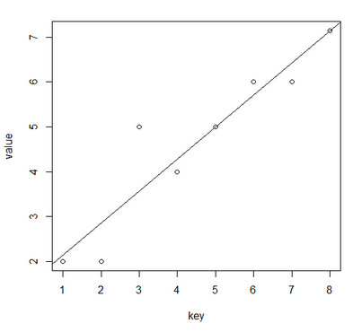

Linear Regression
=================

Linear regression implementation in R (for university course).

##### The initial data
|X (key)|Y (value)|
|-------|-------|
|1|2
|2|2
|3|5
|4|4
|5|5
|6|6
|7|6|

We'll first enter the given data in R and create a scatter plot for it. Then we'll craft for our plot the "line of best fit", or the "least squares regression line".

After that, we'll define the "Pearson's correlation coefficient", commonly called "the correlation coefficient".

The correlation coefficient 0.9053 satisfies the condition -1 <= Rxy <= 1, and indicates a quite strong degree of linear dependence between the given variables.

Finally, we'll predict the value for key = 8.

